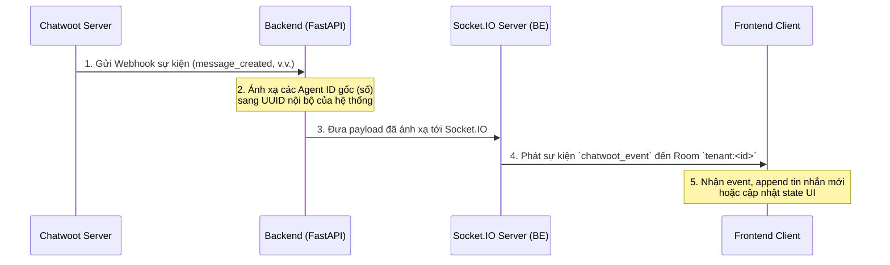

# Hướng dẫn tích hợp Real-time Chatwoot với Frontend

Tài liệu này hướng dẫn cách kết nối client-side (Frontend) tới Socket.IO của Backend để xử lý luồng tin nhắn và sự kiện thời gian thực (real-time) từ Chatwoot mà không cần tải lại trang.

---

## 1. Cơ chế hoạt động (Overview)



---

## 2. Các bước tích hợp phía Frontend

### Bước 2.1: Cài đặt thư viện Socket.IO Client

Sử dụng phiên bản client tương thích với Socket.IO (ở đây là v4.x):

```bash
npm install socket.io-client
```

### Bước 2.2: Khởi tạo kết nối & Xác thực (Handshake & Authenticate)

Kết nối cần truyền qua giao thức WebSockets và thực hiện gửi JWT token qua kênh `authenticate` ngay sau khi thiết lập kết nối ban đầu.

```javascript
import { io } from "socket.io-client";

// Khởi tạo kết nối
const socket = io("https://devomnichannelcgv.telesip.vn", {
  path: "/socket.io",
  transports: ["websocket"],
  autoConnect: true,
});

// 1. Khi kết nối ban đầu thành công, gửi sự kiện authenticate
socket.on("connection_established", (data) => {
  console.log("Socket.IO connected, initiating authentication...", data);

  const token = localStorage.getItem("access_token"); // Lấy JWT token của user
  socket.emit("authenticate", { token: token });
});

// 2. Xác thực thành công (Backend tự động cho kết nối join vào room `tenant:<tenant_id>`)
socket.on("authenticated", (data) => {
  console.log("Socket.IO authenticated successfully!", data);
});

// 3. Xử lý khi token lỗi hoặc hết hạn
socket.on("authentication_error", (error) => {
  console.error("Socket.IO authentication failed:", error.message);
  // Ví dụ: thực hiện refresh token hoặc chuyển hướng đăng nhập
});
```

---

## 3. Lắng nghe sự kiện Chatwoot (`chatwoot_event`)

Toàn bộ thông tin cập nhật từ Chatwoot sẽ được phát qua kênh sự kiện `"chatwoot_event"`. Cấu trúc gói tin nhận được:

```json
{
  "event": "message_created", // hoặc "message_updated", "conversation_status_changed", "conversation_updated"
  "payload": {
    // Thông tin chi tiết của sự kiện đã được Backend ánh xạ ID sang UUID nội bộ
  }
}
```

### Code mẫu xử lý sự kiện trong ứng dụng (React/Vue/JS):

```javascript
socket.on("chatwoot_event", (data) => {
  const { event, payload } = data;
  console.log(`Nhận sự kiện Chatwoot real-time [${event}]:`, payload);

  switch (event) {
    case "message_created":
      handleRealtimeMessageCreated(payload);
      break;

    case "conversation_status_changed":
      handleRealtimeConversationStatus(payload);
      break;

    case "conversation_updated":
      handleRealtimeConversationUpdated(payload);
      break;

    default:
      console.warn("Sự kiện chưa được xử lý đặc biệt:", event);
  }
});
```

---

## 4. Xử lý các sự kiện chính (State Update)

### 4.1 Sự kiện tin nhắn mới (`message_created`)

Được kích hoạt khi khách hàng nhắn tin hoặc một agent khác gửi tin nhắn trong hội thoại.

- **Đặc điểm:** Trường `sender.id` của agent gửi tin nhắn đã được Backend tự động đổi từ ID số nguyên của Chatwoot sang **UUID của User** trong hệ thống nội bộ của bạn.
- **Xử lý State:**

```javascript
function handleRealtimeMessageCreated(messagePayload) {
  const newRawMessage = messagePayload;
  const conversationId = newRawMessage.conversation.id; // Chatwoot Conversation ID (int)

  // 1. Nếu đang hiển thị hội thoại này, append tin nhắn mới vào danh sách
  if (
    currentActiveConversation &&
    currentActiveConversation.id === conversationId
  ) {
    setMessages((prevMessages) => {
      // Tránh trùng lặp tin nhắn
      if (prevMessages.some((msg) => msg.id === newRawMessage.id)) {
        return prevMessages;
      }
      return [...prevMessages, newRawMessage];
    });
  }

  // 2. Cập nhật tin nhắn mới nhất hiển thị ở danh sách hội thoại bên sidebar
  updateSidebarLastMessage(conversationId, newRawMessage);
}
```

### 4.2 Sự kiện thay đổi trạng thái hội thoại (`conversation_status_changed`)

Được kích hoạt khi hội thoại chuyển sang trạng thái: `resolved` (hoàn thành), `open` (đang mở), `snoozed` (tạm hoãn).

- **Xử lý State:**

```javascript
function handleRealtimeConversationStatus(statusPayload) {
  const conversationId = statusPayload.id;
  const newStatus = statusPayload.status; // "resolved" | "open" | "snoozed"

  // Cập nhật lại UI trạng thái hội thoại
  updateConversationStatusInState(conversationId, newStatus);
}
```

### 4.3 Sự kiện gán người xử lý (`conversation_updated`)

Kích hoạt khi hội thoại được gán cho Agent mới hoặc chuyển giao giữa các bộ phận.

- **Đặc điểm:** Đối tượng `payload.assignee` đã được Backend chuyển đổi trường `id` sang UUID nội bộ của Agent.
- **Xử lý State:**

```javascript
function handleRealtimeConversationUpdated(payload) {
  const conversationId = payload.id;
  const assignee = payload.assignee; // Đã được map UUID

  // Cập nhật lại thông tin Agent đang phụ trách trên giao diện chat
  updateConversationAssigneeInState(conversationId, assignee);
}
```

---

## 5. Mẹo & Thực hành tốt nhất (Best Practices)

1. **Đồng bộ hóa Client-side:** Sử dụng trường `id` của tin nhắn (`message.id` của Chatwoot) làm khóa chính (`key` trong React/Vue) để ngăn ngừa hiển thị trùng lặp tin nhắn khi Agent gửi đi (người gửi vừa tạo tin cục bộ trên UI vừa nhận được sự kiện qua socket).
2. **Reconnection (Tự động kết nối lại):** Khi kết nối socket bị ngắt và kết nối lại, Backend sẽ tự động phát các thông báo bị lỡ (`missed_notifications`). Tuy nhiên đối với tin nhắn hội thoại, Frontend nên gọi lại API `GET /conversations/{id}/messages` để lấy đầy đủ lịch sử tin nhắn mới nhất nhằm phòng tránh mất gói tin lúc offline.
